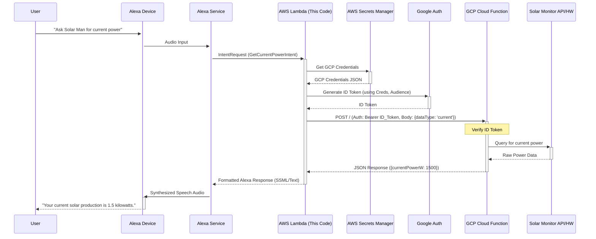

# Alexa Solar Monitor Backend

[](https://github.com/your-username/alexa-solar-handler) <!-- Replace with actual build badge if you set up CI -->
[](https://github.com/your-username/alexa-solar-handler) <!-- Replace with actual coverage badge -->
[](https://opensource.org/licenses/MIT) <!-- Or choose your license -->

This repository contains the AWS Lambda backend code (written in Node.js) for the "Solar Man" Alexa skill (or your chosen invocation name). It allows users to query their solar energy monitoring system for real-time data, daily summaries, and system status via voice commands.

The Lambda function acts as a secure intermediary, authenticating requests and forwarding them to a Google Cloud Platform (GCP) Cloud Function which, in turn, communicates with the actual solar monitoring hardware/API.

## Features

The Alexa skill powered by this backend can handle the following user requests:

*   **Launch Request:** Welcomes the user upon skill invocation.
*   **Current Power:** Get the current solar power generation in watts/kilowatts (e.g., "Alexa, ask Solar Man what's the current power?").
*   **Daily Production:** Get the total solar energy produced so far today in kilowatt-hours (e.g., "Alexa, ask Solar Man how much energy was produced today?").
*   **Online Status:** Check if the solar monitoring system is currently online and reporting data (e.g., "Alexa, ask Solar Man is the system online?").
*   **Summary:** Get a combined summary including current power, daily production, and online status (e.g., "Alexa, ask Solar Man for a summary.").
*   **Help:** Provides guidance on how to use the skill.
*   **Stop/Cancel:** Ends the skill session.
*   **Fallback:** Handles unrecognized commands gracefully.

## Architecture Overview

The system follows this general flow:

1.  **User** -> **Alexa Device**: User speaks a command (e.g., "Alexa, ask Solar Man for current power").
2.  **Alexa Device** -> **Alexa Service**: Audio is processed into a structured request (IntentRequest).
3.  **Alexa Service** -> **AWS Lambda**: The request is sent to this Lambda function's configured endpoint ARN.
4.  **AWS Lambda**:
    *   Initializes logger (Pino).
    *   Retrieves GCP service account credentials securely from **AWS Secrets Manager**.
    *   Uses credentials to generate a Google OIDC **ID Token** scoped for the target GCP Function audience.
    *   Identifies the user's intent via the `router.mjs`.
    *   Calls the appropriate intent handler function.
5.  **Intent Handler** (within Lambda):
    *   Constructs a payload (e.g., `{ dataType: 'current' }`).
    *   Makes a secure HTTPS POST request to the **GCP Cloud Function URL** (`TARGET_AUDIENCE`), including the generated `Authorization: Bearer <ID_TOKEN>` header and the JSON payload.
6.  **GCP Cloud Function**:
    *   Receives the request.
    *   **Verifies the ID Token** (audience, issuer, signature) to ensure the request came from the authorized Lambda function.
    *   Parses the `dataType` from the payload.
    *   Communicates with the underlying solar monitoring system's API or hardware interface.
    *   Formats the data into the expected JSON response (e.g., `{ "currentPowerW": 1500 }`).
    *   Returns the JSON response to the Lambda function.
7.  **Intent Handler** (within Lambda):
    *   Receives the response from the GCP Function.
    *   Parses the data.
    *   Formats a user-friendly spoken response string.
    *   Builds the Alexa response object using the ASK SDK.
8.  **AWS Lambda** -> **Alexa Service**: Returns the formatted JSON response.
9.  **Alexa Service** -> **Alexa Device**: Synthesizes the text into speech.
10. **Alexa Device** -> **User**: Speaks the response (e.g., "Your current solar production is 1.5 kilowatts.").



## Technology Stack

*   **Runtime:** Node.js (v18.x or later recommended for Lambda)
*   **Alexa SDK:** `ask-sdk-core`, `ask-sdk-model` (v2)
*   **Authentication:** `google-auth-library` (for GCP ID Tokens)
*   **AWS Services:**
    *   AWS Lambda (Compute)
    *   AWS Secrets Manager (Storing GCP Credentials)
    *   Amazon CloudWatch Logs (Logging)
*   **GCP Services:**
    *   Google Cloud Functions (Receives requests from Lambda)
    *   Google Identity Platform / IAM (Service Accounts, ID Tokens)
*   **Testing:** Jest
*   **Logging:** Pino (for structured JSON logging)
*   **Packaging:** Standard `npm` scripts / manual zipping

## Prerequisites

*   **Node.js & npm:** Install Node.js (LTS version recommended) which includes npm.
*   **AWS Account:** An active AWS account with permissions to manage Lambda, Secrets Manager, and CloudWatch Logs.
*   **GCP Account:** An active Google Cloud Platform account with permissions to create Cloud Functions and Service Accounts.
*   **Alexa Developer Console Account:** To create and configure the Alexa skill frontend.
*   **Solar Monitoring System:** Access to your solar monitoring system's API or data interface (this backend assumes a GCP function handles that specific communication).

## Setup & Installation

1.  **Clone the Repository:**
    ```bash
    git clone https://github.com/your-username/alexa-solar-handler.git
    cd alexa-solar-handler
    ```

2.  **Install Dependencies:**
    ```bash
    npm install
    ```

3.  **GCP Setup:**
    *   Create a **GCP Service Account** in your GCP project. Grant it the necessary roles (minimally, `roles/cloudfunctions.invoker` on the target Cloud Function).
    *   Download the **JSON key file** for this service account. **Treat this file securely!**
    *   Deploy your **GCP Cloud Function** that will interact with your solar monitor. Ensure it:
        *   Is triggered via HTTPS.
        *   Requires authentication (using Google ID Tokens).
        *   Accepts POST requests with a JSON body like `{ "dataType": "..." }`.
        *   Returns JSON responses like `{ "currentPowerW": 123 }`, `{ "dailyProductionKWh": 4.5 }`, `{ "isOnline": true }`.
        *   Note its **HTTPS Trigger URL**. This will be your `TARGET_AUDIENCE`.

4.  **AWS Secrets Manager Setup:**
    *   Go to AWS Secrets Manager in the AWS Console.
    *   Create a new secret.
    *   Choose "Other type of secret".
    *   Select the "Plaintext" tab.
    *   **Paste the entire content** of the downloaded GCP Service Account JSON key file into the plaintext field.
    *   Give the secret a descriptive name (e.g., `alexa-solar/gcp-credentials`). Note this **Secret Name or ARN**. This will be your `GCP_SECRET_ID`.

5.  **Configure Environment Variables:**
    *   This project uses environment variables for configuration, essential for deployment. For local testing, you can create a `.env` file in the project root (this file is ignored by Git via `.gitignore`).
    *   Create a file named `.env` and add the following, replacing the placeholder values:

    ```dotenv
    # .env file for local development/testing

    # The Secret Name or ARN from AWS Secrets Manager containing the GCP service account JSON key
    GCP_SECRET_ID=alexa-solar/gcp-credentials

    # The HTTPS Trigger URL of your deployed GCP Cloud Function
    TARGET_AUDIENCE=https://your-region-your-project.cloudfunctions.net/your-solar-function

    # Optional: Logging level (trace, debug, info, warn, error, fatal) - defaults to 'info'
    LOG_LEVEL=debug
    ```

## Testing

This project uses Jest for unit and integration tests.

*   **Run all tests:**
    ```bash
    npm test
    ```
    *Alternatively:*
    ```bash
    npm run test:unit
    npm run test:integration
    ```

*   **Run tests with coverage report:**
    ```bash
    npm run test:coverage
    ```
    (Coverage reports appear in the `coverage/` directory).

*   **Run specific tests:** Use Jest's standard CLI options (e.g., `npm test -- -t "GetCurrentPowerIntent"`).

**Note:** Integration tests mock the external boundaries (AWS Secrets Manager, Google Auth, GCP Function call) but test the internal routing and handler logic flow within the Lambda code.

## Deployment to AWS Lambda

1.  **Package the Function:** Create a deployment package (ZIP file) containing the code and `node_modules`. You might need a build step if using TypeScript, otherwise:
    *   Ensure `node_modules` are installed (`npm install`).
    *   Create a ZIP file containing `src/`, `node_modules/`, `package.json`, `package-lock.json`. *Do not include the `.env` file or development dependencies if possible.*
        A simple script could be added to `package.json`:
        ```json5
        {
        // package.json scripts section
          "scripts": {
            // ... other scripts
            "package": "rm -f function.zip && zip -r function.zip src/ node_modules/ package.json package-lock.json"
          }
        }
        ```
        Then run:
        ```bash
        npm run package
        ```

2.  **Create/Update Lambda Function:**
    *   Go to the AWS Lambda console.
    *   Create a new function or update an existing one.
    *   **Runtime:** Choose Node.js 18.x (or your target version).
    *   **Architecture:** Choose appropriate (e.g., `arm64`).
    *   **Upload:** Upload the `function.zip` file created in the previous step.
    *   **Handler:** Set the handler to `src/index.handler` (assuming your main exported function in `src/index.mjs` is named `handler`).
    *   **Permissions:** Ensure the Lambda function's **Execution Role** has permissions to:
        *   Read the secret from AWS Secrets Manager (`secretsmanager:GetSecretValue` on the specific secret ARN).
        *   Write logs to CloudWatch Logs (`logs:CreateLogGroup`, `logs:CreateLogStream`, `logs:PutLogEvents`).
    *   **Environment Variables:** Configure the *Lambda function's* environment variables (under Configuration -> Environment variables):
        *   `GCP_SECRET_ID`: The name or ARN of your secret in Secrets Manager.
        *   `TARGET_AUDIENCE`: The HTTPS URL of your GCP Cloud Function.
        *   `LOG_LEVEL`: (Optional) Set the desired logging level (e.g., `info`, `warn`).

3.  **Note the Lambda ARN:** You will need this for the Alexa skill configuration.

## Alexa Skill Configuration

1.  Go to the [Alexa Developer Console](https://developer.amazon.com/alexa/console/ask).
2.  Create a new skill or edit an existing one.
    *   **Model:** Custom
    *   **Hosting:** Provision your own
3.  **Invocation Name:** Set how users will invoke your skill (e.g., "solar man").
4.  **Interaction Model -> JSON Editor:** Paste the contents of the `interactionModel.json` file from this repository (or customize it as needed). Save and Build the model.
5.  **Endpoint:**
    *   Select **AWS Lambda ARN**.
    *   Enter the ARN of the Lambda function you deployed.
6.  **Permissions (If needed):** Enable any specific permissions your skill requires (e.g., location - though not currently used by this backend).
7.  **Testing:** Use the Alexa Simulator in the console or a real Alexa device linked to your developer account to test the skill end-to-end.

## GCP Cloud Function Interface

This Lambda backend expects the corresponding GCP Cloud Function (identified by `TARGET_AUDIENCE`) to adhere to the following interface:

*   **Trigger:** HTTPS
*   **Authentication:** Requires Google-issued OIDC ID Token authentication. The function *must* validate the token's audience, issuer, and signature.
*   **Method:** POST
*   **Request Body (JSON):**
    ```json
    {
    "dataType": "<type>"
    }
    ```
    Where `<type>` is one of: `current`, `daily`, `status`, `summary`.
*   **Response Body (JSON):** Based on the `dataType`:
    *   `current`: `{ "currentPowerW": number }`
    *   `daily`: `{ "dailyProductionKWh": number }`
    *   `status`: `{ "isOnline": boolean }`
    *   `summary`: `{ "currentPowerW": number, "dailyProductionKWh": number, "isOnline": boolean }` (Fields are optional if data isn't available).

## Logging

*   This function uses **Pino** for structured JSON logging, outputting to `console.log` (which integrates with CloudWatch Logs).
*   The default log level is `info`.
*   You can control the log level via the `LOG_LEVEL` environment variable in the Lambda configuration (`trace`, `debug`, `info`, `warn`, `error`, `fatal`).
*   Logs include the AWS Request ID for easier tracing in CloudWatch.

## Contributing

Contributions are welcome! Please feel free to submit pull requests or open issues. Ensure tests pass (`npm test`) and adhere to existing code style (consider running Prettier).

## License

This project is licensed under the MIT License - see the [LICENSE](https://mit-license.org/) file for details. <!-- Create a LICENSE file with MIT text if you choose MIT -->
